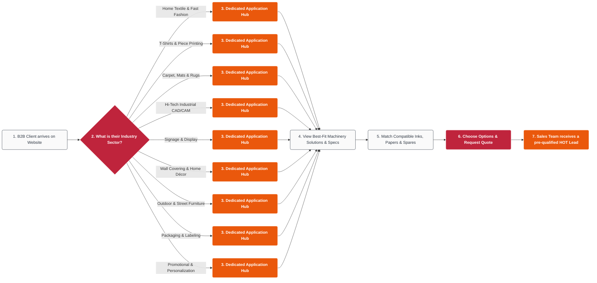
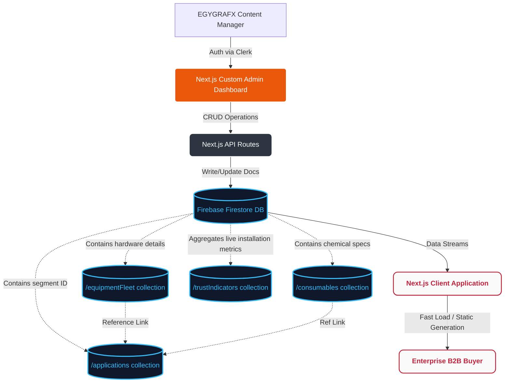
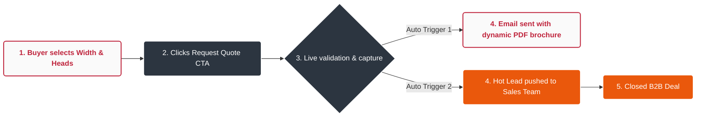

# EGYGRAFX MASTER FLOWCHARTS MANUAL
**Project Reference:** MV-2026-085  
**Design System:** Mitry Visuals High-Contrast Dark-Mode  

This manual aggregates all **5 distinct system architecture and user experience flowcharts** designed for the new EGYGRAFX B2B serverless web platform. All charts are written using **Mermaid.js** syntax, which renders as live visual diagrams in modern Markdown editors, GitHub, and our documentation systems.

---

## 1. 🗺️ Sitemap & Navigation Architecture
Maps the hierarchical layout of the platform, showing how the primary Gateway branches into four pillars (Applications, Products, Consumables, and Fleet Support) and ultimately funnels into the RFQ lead capture engine.

```mermaid
graph TD
    classDef header fill:#bf243c,stroke:#fff,stroke-width:2px,color:#fff,font-weight:bold,rx:10px,ry:10px;
    classDef menu fill:#2c3540,stroke:#fff,stroke-width:1.5px,color:#fff,rx:8px,ry:8px;
    classDef lander fill:#3e4c5e,stroke:#fff,stroke-width:1px,color:#fff,rx:8px,ry:8px;
    classDef detail fill:#fafafa,stroke:#2c3540,stroke-width:1px,color:#2c3540,rx:5px,ry:5px;
    classDef orange fill:#ea580c,stroke:#fff,stroke-width:1px,color:#fff,rx:5px,ry:5px;

    A[EGYGRAFX.COM Home Gateway] --> B[Applications Mega Menu]
    A --> C[Products Directory]
    A --> D[Consumables & Spares]
    A --> E[B2B Support & Fleet Service]

    B --> B1[Home Textile & Fast Fashion]
    B --> B2[T-Shirts & Piece Printing]
    B --> B3[Carpet, Mats & Rugs]
    B --> B4[Hi-Tech Industrial CAD/CAM]
    B --> B5[Signage & Display]
    B --> B6[Wall Covering & Home Décor]
    B --> B7[Outdoor & Street Furniture]
    B --> B8[Packaging & Labeling]
    B --> B9[Specialty & Promo]

    C --> C1[Industrial Printers]
    C --> C2[Cutters & Trimmers]
    C --> C3[Calenders & Presses]

    D --> D1[Premium Inks]
    D --> D2[Papers & PET Film]
    D --> D3[OEM Printheads & Spares]

    B1 --> P1[DGI Poseidon II specs]
    B1 --> P2[Novares ROMA 8 specs]
    B2 --> P3[PolyPrint FilmJet specs]
    B3 --> P4[BYDi XC Carpet specs]
    B4 --> P5[GBOS Laser Systems specs]
    B8 --> P6[JHF CZ2516 Packaging specs]

    P1 & P2 & P3 & P4 & P5 & P6 --> RFQ[Dynamic B2B RFQ Portal]

    class A header;
    class B,C,D,E menu;
    class B1,B2,B3,B4,B5,B6,B7,B8,B9 lander;
    class C1,C2,C3,D1,D2,D3 detail;
    class P1,P2,P3,P4,P5,P6,RFQ orange;
```



---

## 2. 🚶‍♂️ B2B Buyer UX Journey Flowchart
Details the user experience funnel from arrival, through segment self-identification (e.g., Nour's textile shop), spec matching, and automated quotation triggers.



---

## 3. 🔄 Headless CMS & Collection Sync Model
Illustrates how the EGYGRAFX admin team edits database collections (machinery, consumables, metrics) via a secure Clerk-authenticated panel, updating the Next.js pre-rendered pages in real-time.



---

## 4. ✉️ RFQ Lead Capture Funnel & Auto-Brochure Triggers
Maps the background validation engine that intercepts customer selections, generates/fires the branded PDF brochure to their inbox, and alerts the sales desk.



---

## 5. ⚡ Programmatic SEO & ISR Caching Engine
Shows how Next.js pre-renders, caches, and incrementally regenerates (ISR) Google search targets globally at edge CDN nodes to attract organic traffic (e.g. buyers searching 'Kyocera sublimation Egypt').

```mermaid
flowchart LR
    classDef engine fill:#bf243c,stroke:#fff,stroke-width:2px,color:#fff,font-weight:bold,rx:5px;
    classDef page fill:#2c3540,stroke:#fff,stroke-width:1px,color:#fff,rx:5px;
    classDef cache fill:#fafafa,stroke:#3e4c5e,stroke-width:1px,color:#2c3540,rx:5px;

    User[Search Query / User Click] --> DNS{Reverse Proxy / DNS}
    DNS --> Router[Next.js App Router Engine]

    Router -->|/applications/:sector| AppRoute[applications/[sector]/page.tsx]
    Router -->|/brands/:brand| BrandRoute[brands/[brand]/page.tsx]
    Router -->|/products/:model| ProdRoute[products/[brand-model]/page.tsx]

    AppRoute --> ISR{SSG Cache Valid?}
    BrandRoute --> ISR
    ProdRoute --> ISR

    ISR -->|YES| Static[Serve High-Performance static HTML/CSS]
    ISR -->|NO| Regeneration[Background Incremental Static Regeneration - 60s]
    Regeneration --> Firestore[Query Firestore CMS collections]
    Firestore --> Render[Re-render page layout on server]
    Render --> StaticCache[Update Vercel Edge Server Cache]
    StaticCache --> Static

    class Router engine;
    class AppRoute,BrandRoute,ProdRoute page;
    class Static,Regeneration,StaticCache cache;
```
